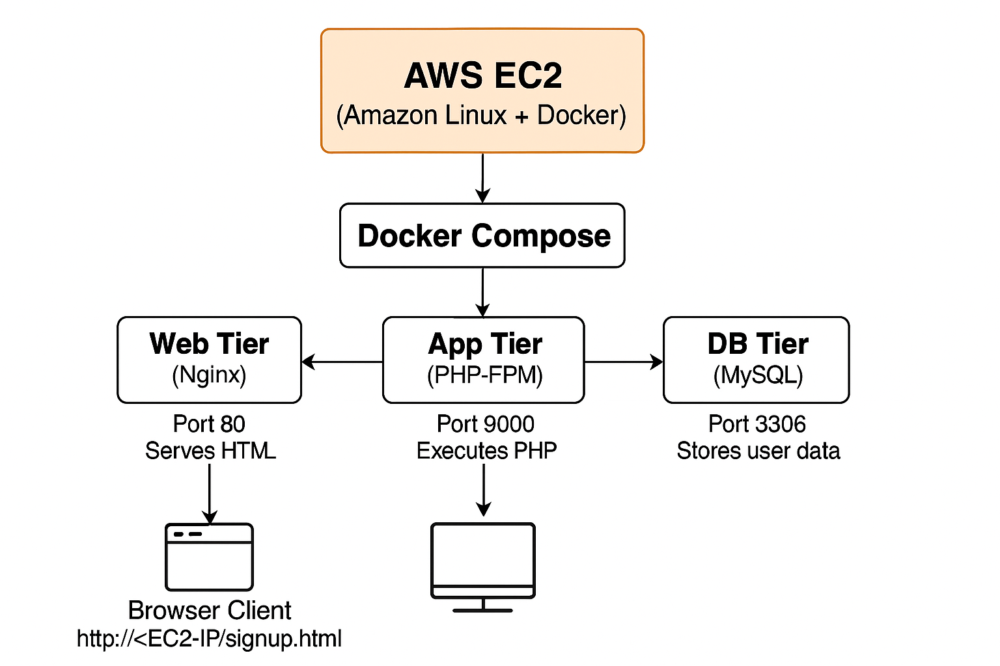
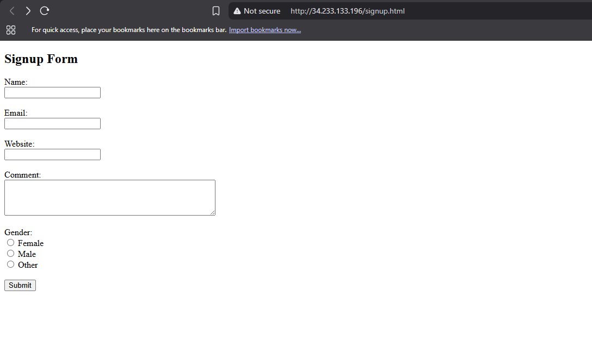

# 🧱 Three-Tier PHP Registration Form Deployment on Docker

A simple **three-tier web application** demonstrating how to deploy a PHP registration form using **Docker** and **Docker Compose** on an **AWS EC2 instance**.

---

## 🖼️ Project Screenshots

| Description | Screenshot |
|--------------|-------------|
| **Architecture Overview** |  |
| **Deployed Application (Signup Form)** |  |
| **MySQL Data Verification** |  |
| **Running Containers on EC2** |  |

> 💡 Place your actual screenshots inside a folder named `images/` at the root of your project.

---

## 🏗️ Architecture Overview

This project follows a **Three-Tier Architecture**:

| Tier | Technology | Role |
|------|-------------|------|
| **Web Tier** | Nginx | Serves frontend HTML and routes PHP requests |
| **App Tier** | PHP-FPM | Executes PHP scripts |
| **DB Tier** | MySQL | Stores user registration data |

Each tier runs in its own **Docker container**, orchestrated using **Docker Compose**.

---

## 🚀 Project Structure

```

threetier/
├── app
│   └── code
│       └── submit.php
├── db
│   ├── Dockerfile
│   └── init.sql
├── docker-compose.yml
└── web
├── code
│   └── signup.html
└── config
└── default.conf

````

---

## ⚙️ Step-by-Step Deployment

### **1️⃣ Launch EC2 Instance**
Launch an **Amazon Linux 2023 (or 2)** EC2 instance (t2.micro recommended).

```bash
ssh -i <your-key.pem> ec2-user@<EC2-Public-IP>
````

---

### **2️⃣ Install Docker & Docker Compose**

```bash
sudo dnf update -y
sudo dnf install docker -y
sudo systemctl enable docker
sudo systemctl start docker
sudo usermod -aG docker ec2-user
```

Logout and reconnect to apply group changes.

**Install Docker Compose:**

```bash
sudo curl -L "https://github.com/docker/compose/releases/latest/download/docker-compose-$(uname -s)-$(uname -m)" -o /usr/local/bin/docker-compose
sudo chmod +x /usr/local/bin/docker-compose
docker-compose --version
```

**Install Buildx (if needed):**

```bash
sudo mkdir -p /usr/libexec/docker/cli-plugins/
sudo curl -L https://github.com/docker/buildx/releases/download/v0.18.0/buildx-v0.18.0.linux-amd64 -o /usr/libexec/docker/cli-plugins/docker-buildx
sudo chmod +x /usr/libexec/docker/cli-plugins/docker-buildx
docker buildx version
```

---

### **3️⃣ Create Project Directory**

```bash
mkdir -p ~/threetier/{web,app,db}
cd ~/threetier
mkdir -p web/{code,config} app/code
```

---

### **4️⃣ Web Tier (Nginx)**

**default.conf**

```nginx
server {
    listen 80;
    server_name localhost;

    root   /usr/share/nginx/html;
    index  signup.html index.php index.html;

    location / {
        try_files $uri $uri/ =404;
    }

    location ~ \.php$ {
        root /app;
        fastcgi_pass app:9000;
        fastcgi_index index.php;
        fastcgi_param SCRIPT_FILENAME /app/$fastcgi_script_name;
        include fastcgi_params;
    }
}
```

**signup.html**

```html
<!DOCTYPE html>
<html>
<head><title>Signup Form</title></head>
<body>
    <h2>Signup Form</h2>
    <form action="submit.php" method="post">
        <label>Name:</label><input type="text" name="name" required><br>
        <label>Email:</label><input type="email" name="email" required><br>
        <label>Website:</label><input type="url" name="website"><br>
        <label>Comment:</label><textarea name="comment"></textarea><br>
        <label>Gender:</label>
        <input type="radio" name="gender" value="female"> Female
        <input type="radio" name="gender" value="male"> Male
        <input type="radio" name="gender" value="other"> Other<br><br>
        <input type="submit" value="Submit">
    </form>
</body>
</html>
```

---

### **5️⃣ Application Tier (PHP-FPM)**

**submit.php**

```php
<?php
$name = $_POST['name'];
$email = $_POST['email'];
$website = $_POST['website'];
$comment = $_POST['comment'];
$gender = $_POST['gender'];

$servername = "db";
$username = "root";
$password = "root";
$dbname = "FCT";

$conn = mysqli_connect($servername, $username, $password, $dbname);
if (!$conn) {
    die("Connection failed: " . mysqli_connect_error());
}

$sql = "INSERT INTO users (name, email, website, comment, gender)
        VALUES ('$name', '$email', '$website', '$comment', '$gender')";
mysqli_query($conn, $sql);
mysqli_close($conn);
?>

<h2>New record created successfully!</h2>
<p>Thank you, <?php echo htmlspecialchars($name); ?>.</p>
```

---

### **6️⃣ Database Tier (MySQL)**

**Dockerfile**

```dockerfile
FROM mysql
ENV MYSQL_ROOT_PASSWORD=root
ENV MYSQL_DATABASE=FCT
COPY init.sql /docker-entrypoint-initdb.d/
EXPOSE 3306
```

**init.sql**

```sql
CREATE TABLE users (
    id INT AUTO_INCREMENT PRIMARY KEY,
    name VARCHAR(50),
    email VARCHAR(100),
    website VARCHAR(255),
    comment VARCHAR(255),
    gender VARCHAR(10)
);
```

---

### **7️⃣ Docker Compose File**

**docker-compose.yml**

```yaml
services:
  web:
    image: nginx
    ports:
      - "80:80"
    volumes:
      - ./web/code/:/usr/share/nginx/html/
      - ./web/config/:/etc/nginx/conf.d/
    depends_on:
      - app
      - db
    networks:
      - webnet

  app:
    image: bitnami/php-fpm
    volumes:
      - ./app/code/:/app
    depends_on:
      - db
    networks:
      - webnet
      - dbnet

  db:
    build: ./db/
    volumes:
      - myvolume:/var/lib/mysql
    networks:
      - dbnet

networks:
  webnet:
  dbnet:

volumes:
  myvolume:
```

---

### **8️⃣ Deploy Containers**

```bash
docker-compose up -d --build
docker ps
```

---

### **9️⃣ Test the Application**

Visit in your browser:

```
http://<EC2-Public-IP>/signup.html
```

Fill in the form → click **Submit** → you’ll see a success message.

---

### **🔟 Verify Data in MySQL**

```bash
docker exec -it threetier_db_1 mysql -uroot -proot FCT
mysql> SELECT * FROM users;
```

---

## 🧩 Troubleshooting

| Issue                      | Cause                      | Solution                                        |
| -------------------------- | -------------------------- | ----------------------------------------------- |
| **404 Not Found**          | Nginx can’t find HTML file | Check `web/code/signup.html` and `default.conf` |
| **Permission denied**      | `.docker` owned by root    | `sudo chown -R ec2-user:ec2-user ~/.docker`     |
| **Buildx missing**         | Plugin not installed       | Reinstall Buildx (see Step 2)                   |
| **Port 80 not accessible** | Security group             | Open port 80 in EC2 inbound rules               |

---


## 🎯 Outcome

✅ Fully containerized **3-tier PHP application** deployed on AWS using Docker Compose.
Demonstrates:

* Multi-container orchestration
* Inter-container networking
* Persistent MySQL storage
* Clean separation of frontend, backend, and database layers

---

